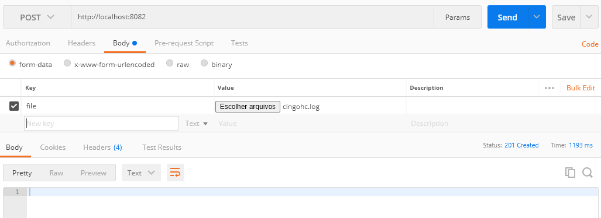

# Servico de gravação de base

### Passos para inicilizar serviço
- buildar dependencias
- executar class [principal](src/main/java/com/gravador/log/GravadorDeLogsApplication.java)
- Projeto estará no ar
  - está usando como database h2
  - documentação com swagger  http://localhost:8082/swagger-ui/index.html
### Passos para uso e gravação de log
Recomendo usar o Postman para teste.

chamada do post, cUrl abaixo para ajudar
```
curl -X POST \
  http://localhost:8082/ \
  -H 'cache-control: no-cache' \
  -H 'content-type: multipart/form-data; boundary=----WebKitFormBoundary7MA4YWxkTrZu0gW' \
  -H 'postman-token: de568d4c-3b19-85ef-ac7c-b00d97a7b2ca' \
  -F file=@cingohc.log
```
-


### Reference Documentation
For further reference, please consider the following sections:

* [Official Apache Maven documentation](https://maven.apache.org/guides/index.html)
* [Spring Boot Maven Plugin Reference Guide](https://docs.spring.io/spring-boot/docs/2.6.11/maven-plugin/reference/html/)
* [Create an OCI image](https://docs.spring.io/spring-boot/docs/2.6.11/maven-plugin/reference/html/#build-image)
* [Spring Boot DevTools](https://docs.spring.io/spring-boot/docs/2.6.11/reference/htmlsingle/#using.devtools)
* [Spring Web](https://docs.spring.io/spring-boot/docs/2.6.11/reference/htmlsingle/#web)
* [Spring Data JPA](https://docs.spring.io/spring-boot/docs/2.6.11/reference/htmlsingle/#data.sql.jpa-and-spring-data)

### Guides
The following guides illustrate how to use some features concretely:

* [Building a RESTful Web Service](https://spring.io/guides/gs/rest-service/)
* [Serving Web Content with Spring MVC](https://spring.io/guides/gs/serving-web-content/)
* [Building REST services with Spring](https://spring.io/guides/tutorials/rest/)
* [Accessing Data with JPA](https://spring.io/guides/gs/accessing-data-jpa/)


